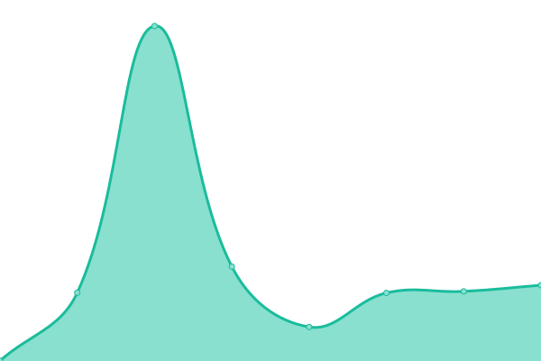

# [📈 Live Status](https://FelipoAntonoff.github.io/uptime): <!--live status--> **🟩 All systems operational**

This repository contains the open-source uptime monitor and status page for [Felipo Antonoff](https://www.codemarket.com.br), powered by [Upptime](https://github.com/upptime/upptime).

With [Upptime](https://upptime.js.org), you can get your own unlimited and free uptime monitor and status page, powered entirely by a GitHub repository. We use [Issues](https://github.com/FelipoAntonoff/uptime/issues) as incident reports, [Actions](https://github.com/FelipoAntonoff/uptime/actions) as uptime monitors, and [Pages](https://FelipoAntonoff.github.io/uptime) for the status page.

<!--start: status pages-->
<!-- This summary is generated by Upptime (https://github.com/upptime/upptime) -->
<!-- Do not edit this manually, your changes will be overwritten -->
<!-- prettier-ignore -->
| URL | Status | History | Response Time | Uptime |
| --- | ------ | ------- | ------------- | ------ |
|  [Codemarket - Loja](https://www.codemarket.com.br/) | 🟩 Up | [codemarket-loja.yml](https://github.com/FelipoAntonoff/uptime/commits/HEAD/history/codemarket-loja.yml) | 

 550ms
     
 | 

<a href="https://FelipoAntonoff.github.io/uptime/history/codemarket-loja">100.00%</a>
    

|  [Codemarket Docs - Site](https://docs.codemarket.com.br/) | 🟩 Up | [codemarket-docs-site.yml](https://github.com/FelipoAntonoff/uptime/commits/HEAD/history/codemarket-docs-site.yml) | 

 669ms
     
 | 

<a href="https://FelipoAntonoff.github.io/uptime/history/codemarket-docs-site">100.00%</a>
    

|  [Felipo Antonoff - Site](https://felipoantonoff.com/) | 🟩 Up | [felipo-antonoff-site.yml](https://github.com/FelipoAntonoff/uptime/commits/HEAD/history/felipo-antonoff-site.yml) | 

 797ms
     
 | 

<a href="https://FelipoAntonoff.github.io/uptime/history/felipo-antonoff-site">100.00%</a>
    

|  [Infinite Cloud - Hospedagem](http://bit.ly/HospedagemInfiniteCloud) | 🟩 Up | [infinite-cloud-hospedagem.yml](https://github.com/FelipoAntonoff/uptime/commits/HEAD/history/infinite-cloud-hospedagem.yml) | 

 1183ms
     
 | 

<a href="https://FelipoAntonoff.github.io/uptime/history/infinite-cloud-hospedagem">99.75%</a>
    

|  [Digital Ocean - Infra](https://www.digitalocean.com/) | 🟩 Up | [digital-ocean-infra.yml](https://github.com/FelipoAntonoff/uptime/commits/HEAD/history/digital-ocean-infra.yml) | 

 131ms
     
 | 

<a href="https://FelipoAntonoff.github.io/uptime/history/digital-ocean-infra">100.00%</a>
    

|  [Amazon AWS - Infra](https://aws.amazon.com/pt/?nc2=h_lg) | 🟩 Up | [amazon-aws-infra.yml](https://github.com/FelipoAntonoff/uptime/commits/HEAD/history/amazon-aws-infra.yml) | 

 259ms
     
 | 

<a href="https://FelipoAntonoff.github.io/uptime/history/amazon-aws-infra">100.00%</a>
    

<!--end: status pages-->

[**Visit our status website →**](https://FelipoAntonoff.github.io/uptime)

## 📄 License

- Powered by: [Upptime](https://github.com/upptime/upptime)
- Code: [MIT](./LICENSE) © [Felipo Antonoff](https://www.codemarket.com.br)
- Data in the `./history` directory: [Open Database License](https://opendatacommons.org/licenses/odbl/1-0/)
